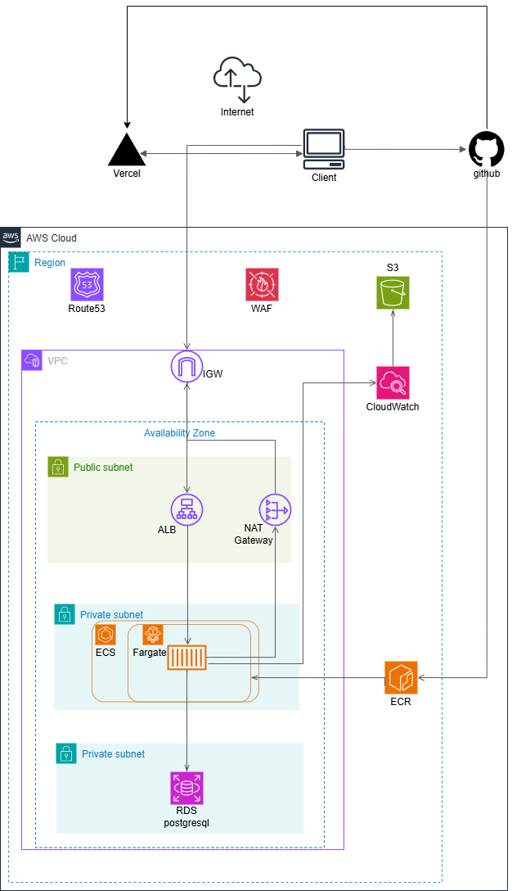

# AWS 3層アーキテクチャ基盤 (Terraform)

Terraformで構築した、AWS上の3層Webアプリケーション基盤です。
ネットワークからコンテナ実行環境、CI/CDまでをコードで一貫管理しています。

## アーキテクチャ図



## アーキテクチャ概要

フロントエンド(Web)とバックエンド(API)を分離し、それぞれ適した基盤にデプロイしています。

```
Client (ブラウザ)
   │
   ▼
Vercel ── Webサーバー (フロントエンド)
   │  API呼び出し (HTTP)
   ▼
[ALB] ── public-subnet (1a / 1d, マルチAZ)  ※このリポジトリの管理範囲
   │
   ▼
[ECS Fargate] ── APIサーバー (Java/Spring Boot) / ecs-sg (ALBからの8080のみ許可)
   │
   ▼
[RDS PostgreSQL] ── private-subnet (1a / 1d) / rds-sg (ECSからの5432のみ許可)

[Bastion EC2] ── public-subnet / SSH鍵はTerraformで自動生成しRDSへのアクセス経路を確保
```

- フロントエンド: Vercelにホスティングし、静的配信・SSRを担当
- バックエンド: このTerraformが構築するAWS基盤 (ALB → ECS Fargate上のJava APIサーバー → RDS)
- VPC: `10.0.0.0/16` を パブリック/プライベート × 2AZ (ap-northeast-1a / 1d) に分割
- IGWとルートテーブルでパブリック/プライベート経路を分離
- セキュリティグループは最小権限で段階的に許可 (ALB → ECS → RDS)

## 使用技術

| レイヤー | 内容 |
|---|---|
| フロントエンド | Vercel (Webサーバー) |
| IaC | Terraform (AWS Provider) |
| ネットワーク | VPC, Subnet, IGW, Route Table |
| ロードバランサ | Application Load Balancer + Target Group |
| コンテナ実行基盤 | ECS (Fargate), ECR |
| データベース | RDS (PostgreSQL 16) |
| ロギング | CloudWatch Logs |
| CI/CD | GitHub Actions (Terraform plan/apply, ECR push, ECSデプロイ) |
| State管理 | S3バックエンド (バージョニング有効) |

## 主な設計ポイント

- **マルチAZ構成**: ALB・ECSサービス・RDSサブネットグループをそれぞれ2つのAZに配置し、単一AZ障害への耐性を確保
- **最小権限のセキュリティグループ**: `alb-sg` → `ecs-sg` → `rds-sg` の順に、上流のSGからの通信のみを許可するチェーン設計
- **踏み台サーバー経由のDBアクセス**: RDSはプライベートサブネットに配置し、直接インターネットからアクセス不可。調査時はBastion EC2経由でのみ接続可能
- **CI/CDパイプライン**: GitHub ActionsでTerraform plan/applyを自動化。アプリケーション側もDockerイメージビルド→ECR push→ECSサービス更新までを自動化
- **コスト意識**: 未使用時はECSサービスの`desired_count`を0にすることでFargateの課金を止める運用

## ディレクトリ構成

```
.
├── main.tf          # インフラ全体の定義
├── variables.tf     # 変数定義 (機密値はtfvarsで注入)
└── .github/workflows/ci.yml  # Terraform CI/CDパイプライン
```

## 注意事項

- 学習・検証目的の構成のため、HTTPS(ACM/HTTPSリスナー)は未対応です
- `terraform.tfvars` 等の機密情報はリポジトリに含めていません
